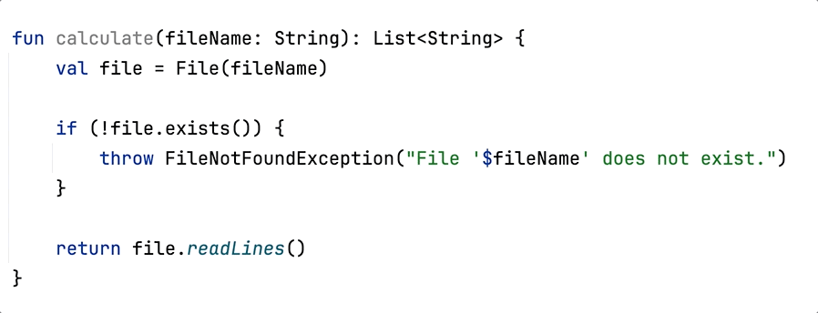

# IDE workshop tutorial

The project aims to demonstrate how to use OpenAI models inside the IntelliJ IDEA plugin.
The plugin provides function name suggestions for Kotlin code.

To learn more, explore
the [IntelliJ Platform SDK documentation](https://plugins.jetbrains.com/docs/intellij/welcome.html) and check out code
samples in the [IntelliJ Platform SDK Code Samples repository](https://github.com/JetBrains/intellij-sdk-code-samples).

## How to build

Available `Run configurations` can be found in `Gradle` → `Run Configurations`:

- `Build Plugin`:
  Runs [`:buildPlugin`](https://plugins.jetbrains.com/docs/intellij/tools-gradle-intellij-plugin.html#tasks-buildplugin)
  task. Build the plugin and saves `.zip`
  archive with
  it in `build/distributions` folder.
- `Run Plugin`:
  Runs [`:runIde`](https://plugins.jetbrains.com/docs/intellij/tools-gradle-intellij-plugin.html#tasks-runide) task. Use
  the *Debug* icon for plugin debugging.
- `Run Qodana`: Runs [`:runInspections`](https://github.com/JetBrains/gradle-qodana-plugin) task. Starts Qodana
  inspections in a Docker container
  and serves a generated report on `localhost:8080`.
- `Run Tests`: Runs [`:test`](https://docs.gradle.org/current/userguide/java_plugin.html#lifecycle_tasks) task.
- `Run Verifications`:
  Runs [`:runPluginVerifier`](https://plugins.jetbrains.com/docs/intellij/tools-gradle-intellij-plugin.html#tasks-runpluginverifier)
  task to check the plugin
  compatibility against the specified IntelliJ IDEs.

## How to install

The plugin requires Java 17 and IntelliJ IDEA of version 2022.3.3 or higher to work.

To install the plugin:

1. Open IntelliJ IDEA and go to `File`/`Settings`/`Plugins`
2. Select the gear icon, and choose `Install Plugin from Disk...`
3. Choose the ZIP archive `ide-workshop-tutorial-0.0.1.zip`
4. Click `Apply`
5. Restart the IDE

## How to use

The plugin requires OpenAI API key. You need to configure `OPENAI_API_KEY` in environment variables on your laptop.

Place the caret at the function name, click the light bulb icon (or press `⌥ Opt ↩ Enter`), and
select `Generate function name` action in the list to generate function name
suggestions.

When a list of suggestions appears, click on any name in the list, and the plugin will perform an automatic rename
method refactoring.

## Contacts

If you have any questions about the use cases, feel free to contact us
using [GitHub issues](https://github.com/JetBrains-Research/ide-workshop-tutorial/issues).

---
Plugin based on the [IntelliJ Platform Plugin Template][template].

[template]: https://github.com/JetBrains/intellij-platform-plugin-template

[docs:plugin-description]: https://plugins.jetbrains.com/docs/intellij/plugin-user-experience.html#plugin-description-and-presentation
